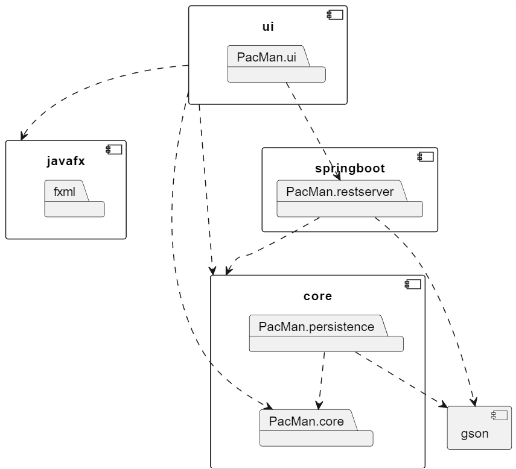
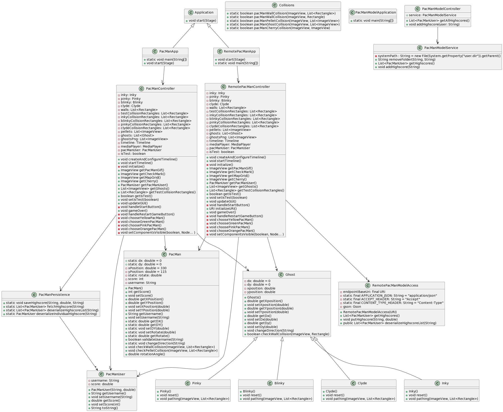
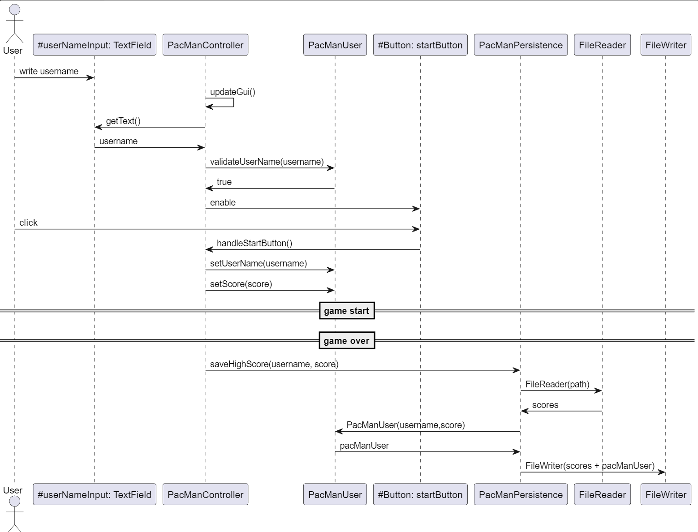
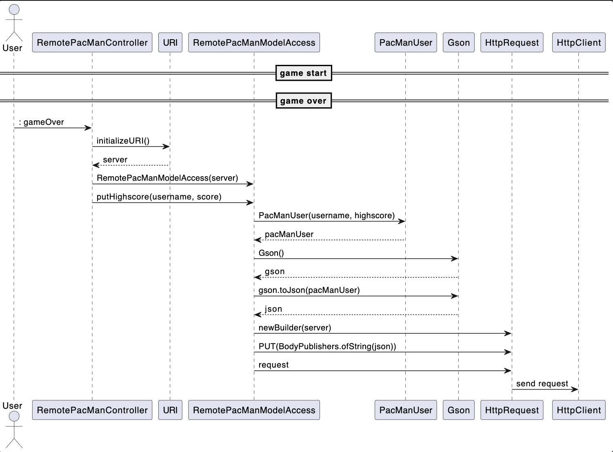

# README for diagrams
This is the documentation for all the diagrams to help visualize and understand the modules and classes interact with one another. 

We have created the following diagrams:
- [README for diagrams](#readme-for-diagrams)
  - [Package diagram](#package-diagram)
    - [Components](#components)
    - [Component dependencies:](#component-dependencies)
  - [Class diagram](#class-diagram)
  - [Sequence diagrams](#sequence-diagrams)
    - [sequence\_local](#sequence_local)
    - [sequence\_remote](#sequence_remote)

## Package diagram
This diagram illustrates the high-level architecture of the PacMan game. The arrows indicate the dependencies, showing how different parts of the system rely on each other for functionality.

### Components
- javafx: Represents the JavaFX library, and includes a package inside called fxml.
- core: Represents the core functionality of the system, and has two packages: PacMan.core and PacMan.persistence.
- ui: Represents the user interface of the system, with the package PacMan.ui
- gson: Represents the Gson library.
- springboot: Represents the Spring Boot framework, and it has a package: PacMan.restserver.

### Component dependencies:
- ui relies on javafx, core and the restserver. Meaning that the user inferface depends on javafx for the graphical user interface implementation, core for the functionality of the system and the restserver for the functionality provided by the Spring Boot- based REST server.
- restserver is dependent of gson and core, meaning that it uses the core functionality and the Gson library. 
- The PacMan.persistence component is connected to both "PacMan.core" and gson. This means that the persistence component depends on the functionality provided by the "PacMan.core" package and also utilizes the Gson library (gson).

Underneath you can see the diagram that illustrates the architecture of the project: 

## Class diagram
The class diagram illustrates the different methods and fields in the classes in our application, and the relations in between them. 
- **The white arrows** show inheritance and which sublasses that inherit from which superclasses. For instance, you can see that the subclasses Inky, Pinky, Blinky and Clyde point to their super class Ghost
  
- **The black arrows** show directed associations along with their multiplicity. For instance, PacManController has a directed association to the Ghost class with the a "many"-multiplicity (*), because of its field with a list of Ghost-objects. 
  
- **The visibility** of the methods and fields are stated by the color of the icon before each of them. Green means that they are public and red means that they are private.
  

## Sequence diagrams
In this project there are two ways one can store and fetch scores; locally and remote through a server. The two diagrams illustrate the two different methods for handling the data. 

### sequence_local
The sequence_local is a diagram that illustrates how all highscores are saved when playing the game locally, meaning that scores are not saved on a server. First, the user interacts with the text field "userNameInput" by writing in a username, this interaction is represented as "write username". Meanwhile, the "updateGUI()" method is called simultaneoulsy to check if the username satisfies the demands. "updateGUI()" Disables the startbutton if the username is invalid. "updateGUI()" fetches the username with "getText" from the "userNameInput" text field. 

The criteria for a valid username are specified in the PacManUser class, and called in the controller with the method "validateUserName(username)". This method then return a boolean, and if it is true, the "startButton" is enabled. Then the user can start the game by clicking on the "startButton". When the "startButton" is clicked, the controller calls on the class PacManUser to set the name and score, this is done with the methods: "setUserName(username)" and "setScore." 

When the game ends the user's score is set. The PacManController has a method called "gameOver", that saves the score. The PacManController calls the "saveHighScore(username, score)" method in PacManPersistence. PacManPersistence interacts with a FileReader to read the existing scores. After a PacManUser is created from the retrieved data, username and score, PacManPersistence uses a FileWriter to write updated scores. Both the original scores and the new score (username, score) that has just been added are written to the file.

Underneath you can see sequence diagram that illustrates local storing of highscores:

### sequence_remote
The sequence_remote illustrates how scores are saved for the remotePacManController. The user interacts by entering a userName in the TextField: "#userNameInput". This is stored temporarily in a PacManUser object in the remote controller until the game is over. This is not illustrated in the diagram, because the process is identical to the start process in sequence_local diagram.

When the game is over, the controller, RemotePacManController, initializes a URI using the "initializeURI()" method (the URI is the identifier for the server). A RemotePacManModelAccess instance is then created with the URI as parameter. The controller interacts with the access class, RemotePacManModelAccess, by calling the "putHighScore()" method with username and score as arguments and  creates a new instance of PacManUser. When this information is collected, highscore and username, the putHighScore method in RemotePacManModelAccess sends a HTTP request with the URI given in by the RemotePacManController, and the server adds the new highscore to the database.

Underneath you can see sequence diagram that illustrates remote storing of highscores:
